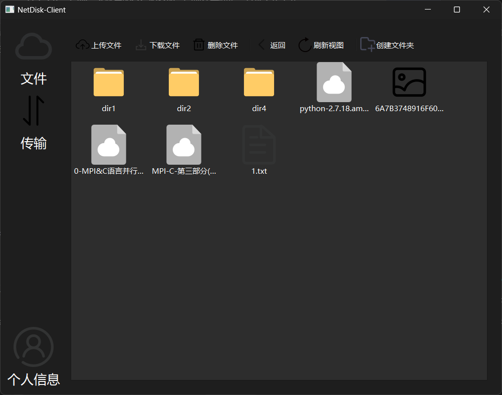
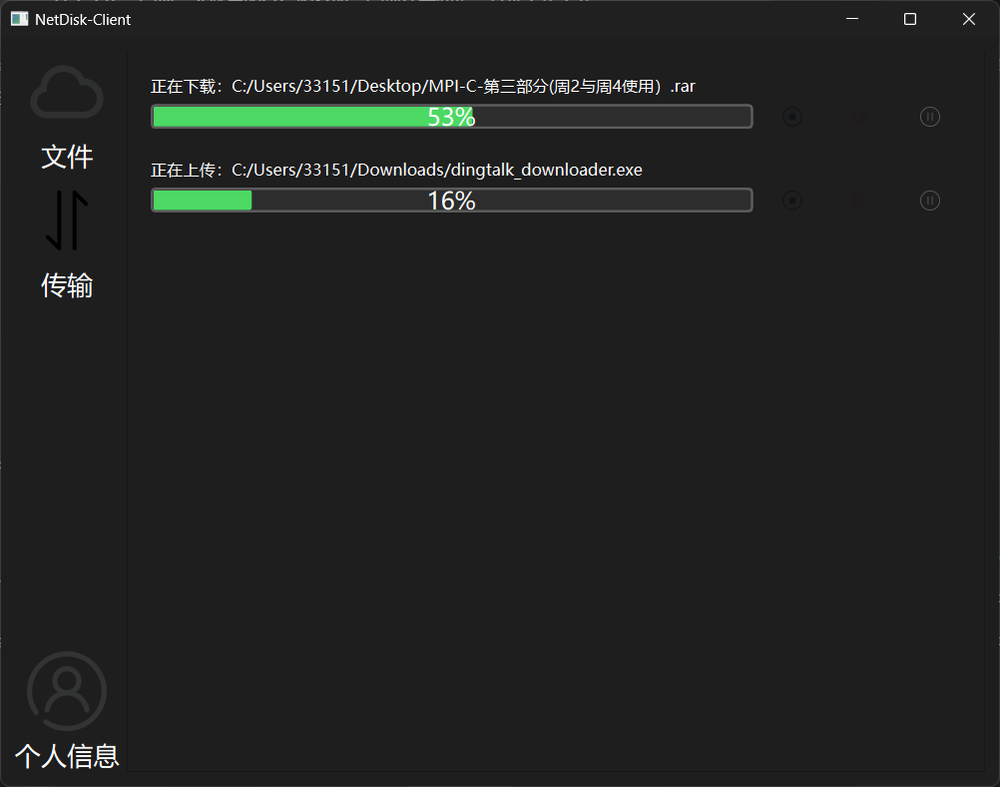
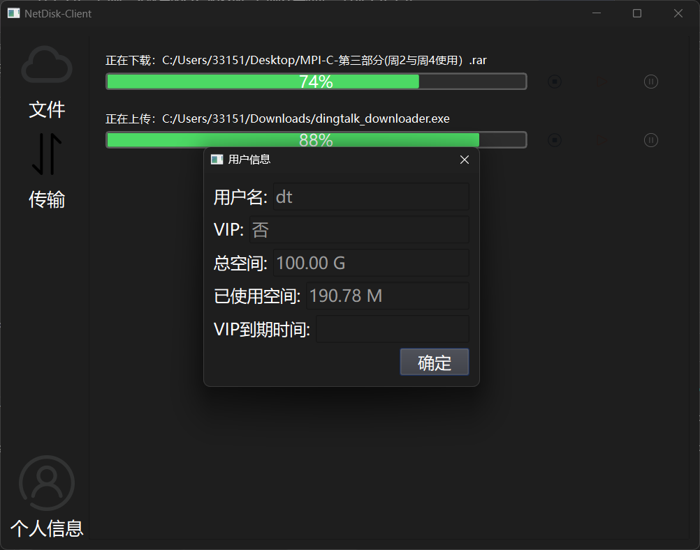

# Qt_Asio_NetDisk
基于Qt和Boost.Asio的网盘项目，客户端在Qt构建，服务端和负载均衡器在linux下构建

完成本项目你需要具备以下基础知识：c++基础（包括智能指针等新特性），Qt基础，linux网络编程和多线程编程

# 介绍

## 服务端

服务端包含以下技术

1、epoll的ET触发，结合非阻塞IO，高效事件响应机制

2、Reactor模型，线程负载均衡

3、openSSL加密通信，哈希算法验证文件的正确性

4、缓冲区池，线程池，数据库连接池

5、分离长任务与短任务，使用不同端口监听长短任务，保证长任务的效率，不卡顿短任务

6、工厂模式（长短任务处理类），单例模式（数据库连接池）

7、设计通信协议，序列化与反序列化

8、高性能缓冲区

9、异步日志库

10、基于小根堆的简单定时器。

11、实现负载均衡器分发客户端连接

12、使用智能指针和RAII机制对资源进行统一管理，防止内存泄露。

## 客户端

1、Model View机制，解耦UI与数据，实现高效虚拟文件视图系统

2、异步IO

3、openSSL加密通信，哈希算法验证文件的正确性

4、与服务端通信的通信协议，序列化与反序列化

5、短任务、长任务分离，避免卡顿UI

6、缓冲区池，线程池

7、UI与逻辑分离







# 环境搭建

## 服务端

（以下已安装的可以跳过）
1、安装c++开发套件

```
sudo apt update
// 安装gdb必须套件
sudo apt install build-essential gdb -y
// 查看是否安装成功
gcc -v && g++ -v && make -v
```


2、安装Openssl

```
sudo apt-get install openssl
openssl version

// 安装openssl开发工具包
sudo apt install libssl-dev

// 生成证书私钥等。会有提示信息，跳过即可
// 注意：cd 到 Server 目录下执行
openssl genpkey -algorithm RSA -out server.key -pkeyopt rsa_keygen_bits:2048
openssl req -new -key server.key -out server.csr
openssl req -x509 -days 365 -key server.key -in server.csr -out server.crt

```

生成成功的话，你的NetDisk-Server/Server目录下因该包含

```
server.crt
server.csr
server.key
```


3、配置数据库

安装数据库（建议上网查找教程）

```
sudo apt-get update

// 安装
sudo apt-get install mysql-server
// 启动（可能会失败，我使用的WSL2，会失败）
// 失败可以试试 sudo service mysql start
sudo systemctl start mysql
//安全配置脚本，运行后会让你做出一些选择。这里需要注意选择root账号需要密码登陆，设置完后在更改root密码。否则会出现数据库无法连接
sudo mysql_secure_installation

// 登录mysql
mysql -u 用户名（一般为root） -p
// 回车后提示输入密码，输入即可
```

设置数据库。

```
// 登录mysql后，执行以下命令
// 创建数据库
CREATE DATABASE Netdisk;

// 切换数据库
use Netdisk

// 创建用户表
CREATE TABLE `Users` (
  `User` varchar(50) CHARACTER SET utf8mb4 COLLATE utf8mb4_0900_ai_ci NOT NULL,
  `Password` varchar(50) CHARACTER SET utf8mb4 COLLATE utf8mb4_0900_ai_ci NOT NULL,
  `Cipher` text NOT NULL,
  `IsVip` tinyint(1) NOT NULL DEFAULT '0' COMMENT 'isvip',
  `CapacitySum` bigint DEFAULT '107374182400' COMMENT 'The total capacity sum',
  `usedCapacity` bigint DEFAULT '0' COMMENT 'used capacity',
  `Salt` char(8) DEFAULT NULL,
  `VipDate` date DEFAULT NULL,
  PRIMARY KEY (`User`)
) ENGINE=InnoDB DEFAULT CHARSET=utf8mb4 COLLATE=utf8mb4_0900_ai_ci

// 创建文件表
CREATE TABLE `FileDir` (
  `Fileid` bigint unsigned NOT NULL AUTO_INCREMENT COMMENT 'fileID',
  `User` varchar(50) CHARACTER SET utf8mb4 COLLATE utf8mb4_0900_ai_ci NOT NULL,
  `FileName` varchar(255) NOT NULL,
  `DirGrade` int unsigned NOT NULL DEFAULT '0',
  `FileType` varchar(10) NOT NULL,
  `MD5` varchar(200) CHARACTER SET utf8mb4 COLLATE utf8mb4_0900_ai_ci DEFAULT NULL,
  `FileSize` bigint unsigned DEFAULT NULL,
  `ParentDir` bigint unsigned DEFAULT '0' COMMENT 'PatentDir ID',
  `FileDate` datetime NOT NULL DEFAULT CURRENT_TIMESTAMP COMMENT 'FILE PUT DATA',
  PRIMARY KEY (`Fileid`,`User`)
) ENGINE=InnoDB AUTO_INCREMENT=255 DEFAULT CHARSET=utf8mb4 COLLATE=utf8mb4_0900_ai_ci
```

```
退出Myslq终端，回到Linux命令行安装Mysql c++开发框架
quit                                // mysql 终端执行
apt-get install libmysqlcppconn-dev // linux 终端执行
```

4、填写配置文件（server_config.cfg）根据自己的情况填写（一般不需要修改）

```
[Server]
# 服务器地址
host =127.0.0.1
# 短任务端口
port =8080
# 长任务端口
upPort =8081
# 数据库用户名
sqlUser =root
# 数据库密码
sqlPwd =123456
# 数据库名
dbName =Netdisk
# 数据库连接池数量
connPoolNum =10
# 数据库端口
sqlport =3306
# 线程池数量
threadNum =10
# 日志队列数量
logqueSize =10
# 连接超时时间
timeout =1800000

[Equalizer]
# 负载均衡器ip
EqualizerIP =127.0.0.1
# 负载均衡器端口
EqualizerPort =9090
# 连接负载均衡器的密码
EqualizerKey =abc9988220
# 当前服务器名
servername =广东服务
# 当前服务器是否连接负载均衡器
IsConEualizer=true
```

```
// 配置完成后再 Server 目录下执行make
make

// 编译完成后，再Server/bin下会有两个可执行文件
./bin/server_release        // 正常版本
./bin/server_debug          // debug版本
```

## 客户端
客户端我使用的Qt版本为 Qt6.9.0，直接在 Qt Creater 中打开.pro文件即可，如果你在服务端修改了服务器信息，记得在protocol.h文件中同步。

```
#define MainServerIP "127.0.0.1"    // 主服务器ip（负载均衡器）
#define MainServerPort 9091         // 主服务器端口（负载均衡器）
#define DefaultServerIP "127.0.0.1" // 默认服务器，负载均衡器无法连接时使用
#define DefaultServerSPort 8080     // 默认服务器短任务端口
#define DefaultServerLPort 8081     // 默认服务器长任务端口
```

客户端需要boost库和openssl，在网上查找教程下载（注意boost库需要MinGW编译的版本）

boost：下载完成后将INCLUDEPATH和LIBS中的 D:/boost_1_88_0 路径修改为你的路径

注意：LIBS += -lboost_system-mgw14-mt-x64-1_88 LIBS += -lboost_thread-mgw14-mt-x64-1_88 表示连接 system 和 thread 库

其中的mgw表示MinGW编译的版本，1_88为版本，可能与我不一致，在"你的boost目录/stage/lib"查找具体名字

```
# 添加 Boost 头文件路径
INCLUDEPATH += "D:/boost_1_88_0"
# 添加 Boost 库路径
LIBS += -L"D:/boost_1_88_0/stage/lib"
# 链接必要的库
LIBS += -lboost_system-mgw14-mt-x64-1_88
LIBS += -lboost_thread-mgw14-mt-x64-1_88
```

openssl：同理将 INCLUDEPATH和LIBS中的 "D:/OpenSSL" 替换为你的openssl库路径

```
# 添加 OpenSSL 头文件和库路径
INCLUDEPATH += "D:/OpenSSL/include"
LIBS += -L"D:/OpenSSL/lib64" -lcrypto -lssl
```
